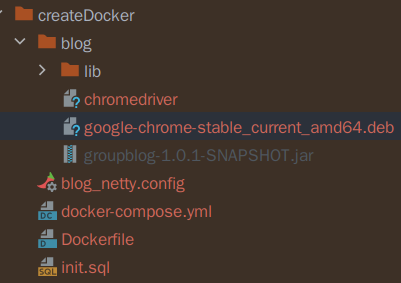
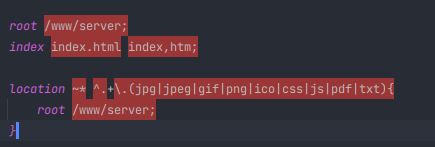

# GroupBlog 群博系统

## 项目介绍

汇集小组成员的博客以便于统一展示、检索。

小组成员目前常用的博客多为 CSDN，少数为 Hexo 等自行搭建的博客平台。针对此，使用 Selenium 定时爬取成员的博客内容，页面的解析和直接获取使用 jsoup 来处理，同时为了避免每次暴力查询用户所有的博客，通过 CSDN 提供的简要的 Feed 订阅数据获取博客的爬取范围。Feed 订阅使用 Rome 库来处理，同时也适配了基于 AtomV1.0 的 Feed 订阅。

为了有一个较好浏览体验，没有自行造轮子编写前端页面，在 Hexo 热度最高的主题之一：[***hexo-theme-next***](https://github.com/iissnan/hexo-theme-next) 的基础上进行二次修改，并结合 Thymeleaf 完成了博客数据的展示。

## 项目结构

项目分为管理端和页面展示部分。

### 管理端

目前只实现了用户个人信息的修改以及博客参数的设置。

使用前后端分离的设计思想，前端发送 ajax 请求，后端响应 json 数据。前端使用 layui 实现。

```shell
./admin
└── src
    ├── user.html // 管理页面
    ├── css
    ├── images
    ├── index.html // 登录界面
    ├── js
    └── lib
        └── layui
```

### 页面展示

```shell
./server
├── bin
│   ├── ca-certificate-rsa.cer 	// BrowserMobProxy需要的CA证书(old)
│   ├── old_group_blog.sql          // 数据库建立文件
│   └── importCert.sh           // 导入CA证书脚本(old)
└── src
    ├── main
    │   ├── java				// 源码
    │   │   └── top
    │   │       └── xcphoenix
    │   │           └── groupblog
    │   │               ├── ...
    │   │               └── ...
    │   └── resources
    │       ├── application.yml  		 // 服务相关配置
    │       ├── config              	 // 配置
    │       │   ├── content				 // 博客内容抓取的xpath等
    │       │   │   ├── articleBlogRule.yml  普遍rss与atom抓取配置
    │       │   │   └── csdnBlogRule.properties csdn抓取配置
    │       │   ├── manager         	 // csdn原文属性等配置
    │       │   │   └── csdnManager.properties
    │       │   ├── overview        	 // csdn用户中心的xpath等
    │       │   │   └── csdnBlogRule.properties
    │       │   ├── processor.properties // selenium使用的chromedriver路径设置
    │       │   └── view                 // 站点信息、关于页面的数据配置
    │       │       ├── about.yml
    │       │       └── site.yml
    │       ├── logback.xml			// 日志配置
    │       ├── mybatis
    │       │   ├── mapper      	// mapper文件位置
    │       │   │   └── ...*.xml 
    │       │   └── mybatis-config.xml 
    │       ├── rome.properties 	// rome库配置
    │       ├── static          	// 前端静态资源
    │       └── templates       	// 前端thymeleaf
    │           
    └── test // 测试类
```

## 项目配置

> 上图为部署时的目录结构：  
> - google-chrome-stable_current_amd64.deb为google-chrome浏览器，为不必要手动添加项，Dockerfile中有安装，如无正常安装，则需要注释掉Dockerfile中的`RUN wget https://dl.google.com/linux/direct/google-chrome-stable_current_amd64.deb
> `,手动加入该包。  
> -
> - chromeedriver为chrome驱动，需要手动添加，注意与chrome浏览器的版本对应关系，该处chrome浏览器直接下载最新版本。
> - 
> - groupblog-1.0.1-SNAPSHOT.jar为该项目的jar包，推荐使用mvn打包，记得把lib文件夹也放入，因为mvn打包配置信息将第三方库与主程序分开了。
> - 
> - 根据实际情况更改 `resource/config/view` 下面的配置文件设置站点和关于页面的数据信息
> - 
> - 注意修改`resource/config/processor.properties`配置文件中的信息。
> - 
> - blog_nginx.config为该项目nginx的配置文件，使用include导入即可，因为本次nginx使用OpenResty部署，所以没有写nginx的docker。
> - 注意： 如要使用头像，OpenResty部署的nginx要关闭缓存，否则头像无法替换，nginx.conf位置一般为`/usr/local/openresty/nginx/conf/nginx.conf`.
> - 
> - init.sql为数据库文件


>上图为`resource/config/processor.properties`文件
> - processor.selenium.chrome-driver.location为chromedriver驱动的位置，一般默认查找运行程序的同级目录下的chromedriver文件
> - picture.service-name为图片服务器的域名或是ip地址
> - picture.down为是否获取博客时是否下载图片的选项
> - picture.address为存放图片的文件夹名，存放图片的文件夹与运行的java程序是同级目录的。

### server文件--docker部署
按格式放好部署目录文件后,在docker-compose.yml文件所在目录直接运行
```shell
docker-compose up -d
```
- ~~`-Dconfig-dir` 可选】 指定项目的配置文件，对应项目结构中的 `resources/config` 目录~~

### admin文件--直接部署
> 对于admin文件按照nginx配置文件中的位置加入nginx的docker中即可   
> 例如这里是：

## 项目演示

首页：


分类：


博客归档：


博客页：


具体可查看线上地址：https://blog.xiyoulinux.com/

管理端：


## 项目细节

### 博客类型

以 CSDN 为例，关于博客信息的页面有以下三种：

- 用户中心页面

  `https://blog.csdn.net/{{username}}/article/list/`

- RSS 页面

  `https://blog.csdn.net/{{userName}}/rss/list`

- 博客页面

  `https://blog.csdn.net/[a-zA-Z0-9]+/article/details/[0-9]+`

一般博客都有类似于用户中心和博客信息的页面，有些额外支持了 rss 等。

同时每种博客的url规则不同，为了更加灵活的支持对应的博客类型，将博客需要的url规则以及参数分离，url规则中使用 `{{param}}` 作为参数的占位符。参数的具体值依赖于用户的设置。

***blog_type*** 表的设计：

| 字段             | 类型         | 空   | 默认   | 链接到 | 注释                   |
| ---------------- | ------------ | ---- | ------ | ------ | ---------------------- |
| type_id *(主键)* | int(10)      | 否   |        |        | 类型id                 |
| type_name        | varchar(10)  | 否   |        |        | 类型名                 |
| overview_rule    | varchar(256) | 是   | *NULL* |        | 用户中心表达式         |
| blog_page_rule   | varchar(256) | 是   | *NULL* |        | 博客页url表达式        |
| feed_rule        | varchar(256) | 是   | *NULL* |        | rss订阅                |
| need_arg         | varchar(256) | 是   | *NULL* |        | 博客类型需要的参数     |
| bean_name        | varchar(20)  | 否   |        |        | 执行抓取任务bean的名字 |

在博客抓取的时候，由于每个用户的博客类型可能并不相同，需要不同的处理策略，所以在数据库中保存了对应策略的 bean 名。

### 博客抓取

目前适配了 CSDN(都可以抓取)、有Rss订阅的博客（只能获取rss订阅内的博客，按照article规则获取主要内容） 以及基于 atomv1.0 规则的 Feed 订阅。

- AtomV1.0 

  直接依据 Atomv1.0 规范获取博客的对应信息。

- CSDN

  由于 CSDN 页面的获取相对复杂，目前使用 Selenium 来获取页面，每一次获取都相当使用浏览器去访问，频繁的访问会给本地带来很大的资源消耗。

  幸运的是 CSDN 提供了 RSS 功能，虽然其提供的信息有限，只能展示用户最近几条的博客信息。但一般来说我们的抓取频率要高于用户更新博客的频率，在绝大多数情况下，只要我们目前抓取的用户博客信息较新，用户在数据库中的博客最新抓取时间，会在 rss 页面中最早博客和最新博客的时间区间内，那么我们只需获取比数据库中存储的最新时间还要新的博客，不需要去依次遍历用户主页。

### 内容解析

这部分使用 jsoup 来处理，根据目标元素的 Xpath 或者元素的 `id`、`class`等规则获取对应元素的内容或者属性。同时将这些规则抽离到 properties 文件中，方便日后的更新修改。

### 自定义代理

使用 Selenium 配合 ChromeDriver 来启动无头浏览器来请求页面数据时，我们关注的内容只是博客内容，不需要额外的 css、js、images等，为了减少页面获取的时间，使用库 ***BrowserMobProxy*** 来添加代理，将不需要的内容放入黑名单来加快请求速度（selenium 会等到页面完全加载完之后才会返回，获取一个页面算上启动时间可能五六秒才能获取一个页面）。使用自定义代理前，需要导入CA证书后才可以正常工作，不然会抛出异常。
